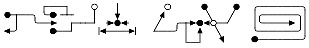

# Joplin Plugin Typograms
This plugin allows you to create Typogram diagrams using the notation defined in https://google.github.io/typograms/.

## Installation

### Automatic Installation
Search for "typograms" in the Joplin plugin manager.

### Manual Installation
1. Download the latest release from GitHub
2. Open `Joplin > Options > Plugins > Install from File`
3. Select the jpl file downloaded from GitHub

## Markdown Syntax
Example syntax:

    ```typogram
              +----+     o    |          o       *      *   .----------.
      *-+---. '-* -+-    |    v         ^         \    /    |.--------.|
        |   '--->   +----+  ->*<-      /   .-+->*<-o--+     |'------> ||
      <-'       *---+     |<----->|   +----' |  ^   \       '---------'|
                                             |__|    v      *----------'
    ```

Produces:



## Building
The plugin may be built with:
```
npm run dist
```
This will generate a jpl file in the publish directory.

